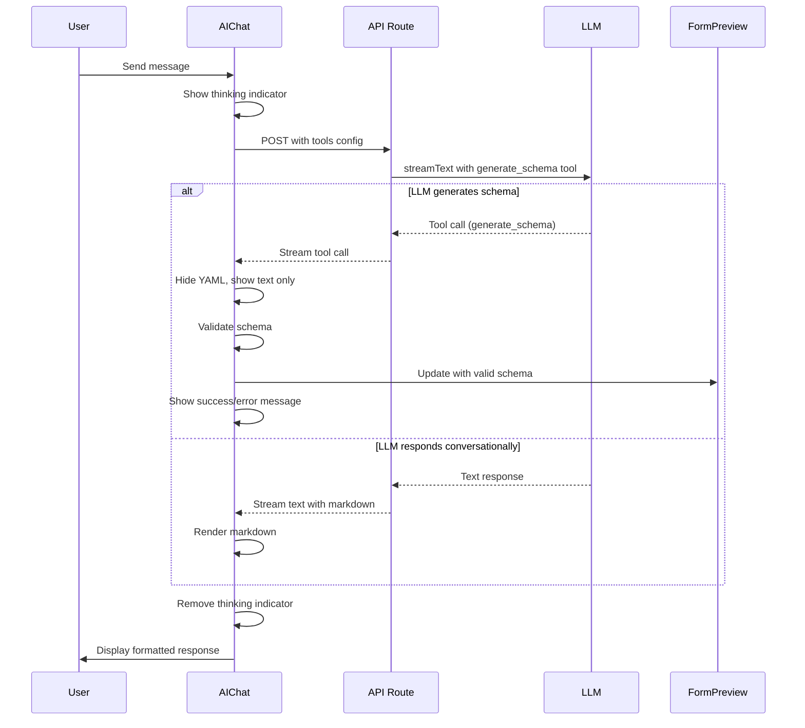

# Design Document: AIChat UI Improvements

## Overview

This design enhances the AIChat component to provide a better user experience during LLM interactions by:
1. Hiding partial YAML during streaming to reduce visual noise
2. Showing a thinking indicator while the LLM processes requests
3. Using AI SDK tool calling to separate YAML schemas from conversational messages
4. Rendering markdown formatting in assistant messages
5. Maintaining all existing validation and error display functionality

The implementation leverages native capabilities of the Vercel AI SDK v6 (tool calling) and assistant-ui (markdown rendering, tool UI components) to achieve these improvements without building custom infrastructure.

## Architecture

### High-Level Flow



### Component Architecture

The solution involves modifications to three main areas:

1. **AIChat Component** (`packages/form-editor/src/components/AIChat.tsx`)
   - Add markdown rendering via `@assistant-ui/react-markdown`
   - Add tool UI component for schema generation
   - Hide YAML content in tool calls
   - Add thinking indicator during streaming

2. **API Route** (`packages/form-editor/src/app/api/llm/route.ts`)
   - Define `generate_schema` tool with Zod schema
   - Configure `streamText` with tools
   - Return tool calls in response stream

3. **Schema Generator** (`packages/form-editor/src/lib/schema-generator.ts`)
   - Update system prompt to instruct LLM to use the tool
   - Maintain existing edit prompt functionality

## Components and Interfaces

### Tool Definition

The `generate_schema` tool will be defined using AI SDK's tool format:

```typescript
import { tool } from 'ai';
import { z } from 'zod';

const generateSchemaTool = tool({
  description: 'Generate or modify a form schema in YAML format. Use this tool whenever you need to create or update a form schema.',
  parameters: z.object({
    yaml: z.string().describe('The complete YAML schema for the form'),
    explanation: z.string().describe('A brief explanation of what was generated or changed'),
  }),
  // No execute function - we handle the result on the client
});
```

### Message Part Types

assistant-ui provides these message part types:
- `text`: Standard conversational text (supports markdown)
- `tool-call`: Tool invocations with `artifact` property

Tool call structure:
```typescript
interface ToolCallMessagePart {
  type: 'tool-call';
  toolCallId: string;
  toolName: string;
  args: { yaml: string; explanation: string };
  artifact?: unknown; // The YAML schema
  status: 'running' | 'complete' | 'incomplete';
}
```

### Custom Tool UI Component

We'll create a custom tool UI component to handle schema generation:

```typescript
const SchemaGeneratorToolUI = makeAssistantToolUI({
  toolName: 'generate_schema',
  render: function SchemaGeneratorToolUI({ args, result, status }) {
    // Don't render the YAML - just show the explanation
    return (
      <div className="my-2">
        {args.explanation && (
          <p className="text-sm text-slate-700">{args.explanation}</p>
        )}
        {status.type === 'running' && (
          <div className="flex items-center gap-2 text-sm text-slate-500">
            <LoadingSpinner />
            <span>Generating schema...</span>
          </div>
        )}
      </div>
    );
  },
});
```

### Markdown Rendering

We'll use `@assistant-ui/react-markdown` for markdown support:

```typescript
import { MarkdownTextPrimitive } from '@assistant-ui/react-markdown';

// In message rendering
<MessagePrimitive.Parts
  components={{
    Text: MarkdownTextPrimitive, // Replaces plain text with markdown
    tools: {
      by_name: {
        generate_schema: SchemaGeneratorToolUI,
      },
    },
  }}
/>
```

### Thinking Indicator

The thinking indicator will be shown when `thread.isRunning` is true and no messages are streaming yet:

```typescript
const ThinkingIndicator = () => (
  <div className="flex items-center gap-2 p-4 text-slate-500">
    <div className="animate-pulse flex gap-1">
      <div className="w-2 h-2 bg-slate-400 rounded-full"></div>
      <div className="w-2 h-2 bg-slate-400 rounded-full animation-delay-200"></div>
      <div className="w-2 h-2 bg-slate-400 rounded-full animation-delay-400"></div>
    </div>
    <span className="text-sm">Thinking...</span>
  </div>
);
```

## Data Models

### Updated System Prompt

The system prompt will be enhanced to instruct the LLM to use the tool:

```
You are a form schema generator assistant. When generating or modifying form schemas, 
you MUST use the generate_schema tool to return the YAML.

IMPORTANT: 
- Always use the generate_schema tool when creating or modifying schemas
- Put the complete YAML schema in the 'yaml' parameter
- Put a brief explanation in the 'explanation' parameter
- You can include additional conversational text in your response alongside the tool call

[... existing catalog documentation ...]
```

### Validation Flow

The validation flow remains largely unchanged:

1. Tool call received with YAML in `args.yaml`
2. Extract YAML from tool call args
3. Validate using existing `validateSchema()` function
4. Store validation results in component state
5. If valid, call `onSchemaGenerated()` to update editor
6. Display validation errors/warnings/success in UI

### State Management

New state additions to AIChat component:

```typescript
// Track tool calls for validation
const [toolCallValidation, setToolCallValidation] = useState<Map<string, {
  yaml: string;
  validationErrors?: string[];
  validationWarnings?: string[];
}>>(new Map());
```

## Correctness Properties


*A property is a characteristic or behavior that should hold true across all valid executions of a system—essentially, a formal statement about what the system should do. Properties serve as the bridge between human-readable specifications and machine-verifiable correctness guarantees.*

### Property 1: YAML Hidden During Streaming

*For any* streaming response containing a YAML schema, the YAML content should not be visible in the rendered UI until the tool call completes.

**Validates: Requirements 1.1, 1.4**

### Property 2: Form Preview Updated on Complete Schema

*For any* valid YAML schema received via tool call, the form preview should be updated with the complete schema once the tool call status is 'complete'.

**Validates: Requirements 1.2**

### Property 3: Explanatory Text Displayed

*For any* tool call with an explanation parameter, the explanation text should be rendered in the UI alongside the tool call.

**Validates: Requirements 1.3**

### Property 4: Thinking Indicator on Message Send

*For any* user message sent, a thinking indicator should appear immediately when the thread status becomes 'running'.

**Validates: Requirements 2.1**

### Property 5: Thinking Indicator Removed on Stream Start

*For any* streaming response, the thinking indicator should not be visible once message content begins streaming.

**Validates: Requirements 2.3**

### Property 6: Tool Call Response Format

*For any* LLM response containing a schema generation, the API should return a tool call message part with toolName 'generate_schema' and the YAML in the args.

**Validates: Requirements 3.1**

### Property 7: YAML Not in Message Bubbles

*For any* tool call containing YAML, the YAML content should not appear in the rendered message bubble text.

**Validates: Requirements 3.2**

### Property 8: Validation Errors Displayed

*For any* invalid YAML schema received, validation error messages should be displayed in the chat interface.

**Validates: Requirements 3.4**

### Property 9: Markdown Rendered as HTML

*For any* text message containing markdown syntax, the rendered output should contain corresponding HTML elements (e.g., `**bold**` → `<strong>bold</strong>`).

**Validates: Requirements 4.1**

### Property 10: Validation Logic Called

*For any* schema received via tool call, the existing validateSchema function should be invoked with the YAML content.

**Validates: Requirements 5.1**

### Property 11: Validation Warnings Displayed

*For any* YAML schema with validation warnings, warning messages should be displayed in the chat interface.

**Validates: Requirements 5.3**

### Property 12: Success Indicator on Valid Schema

*For any* valid YAML schema received, a success indicator message should be displayed in the chat interface.

**Validates: Requirements 5.4**

### Property 13: Tool Call Streaming

*For any* LLM tool call, the API route should include the tool call in the streamed response.

**Validates: Requirements 6.2**

### Property 14: Error Handling

*For any* error during tool execution or streaming, the API route should return an appropriate error response without crashing.

**Validates: Requirements 6.4**

### Property 15: Schema Context in Edits

*For any* edit request with existing schema, the prompt sent to the LLM should include the current schema context.

**Validates: Requirements 7.1**

### Property 16: Provider Compatibility

*For any* supported LLM provider (Anthropic, OpenAI, Google, Bedrock), the tool calling configuration should work correctly.

**Validates: Requirements 7.4**

## Error Handling

### Validation Errors

Validation errors will continue to be handled by the existing `validateSchema()` function. The error display logic remains unchanged:

```typescript
// Validation errors displayed in red
{validation?.validationErrors && validation.validationErrors.length > 0 && (
  <div className="mx-4 my-2 p-3 bg-red-50 border border-red-200 rounded-lg">
    <p className="text-sm font-medium text-red-800 mb-2">Validation Errors:</p>
    <ul className="text-sm text-red-700 space-y-1">
      {validation.validationErrors.map((error, idx) => (
        <li key={idx}>• {error}</li>
      ))}
    </ul>
  </div>
)}
```

### Tool Call Errors

If the LLM fails to call the tool or provides invalid arguments:

1. The tool call status will be 'incomplete' with an error
2. Display an error message in the chat: "Failed to generate schema. Please try again."
3. Log the error for debugging
4. Do not update the form preview

### API Errors

API errors (network, authentication, rate limits) are already handled by the existing error handling in the API route. These will continue to work as before.

### Streaming Errors

If streaming fails mid-response:
1. The `onError` callback in `useChatRuntime` will be triggered
2. Display an error message in the chat
3. Remove the thinking indicator
4. Allow the user to retry

## Testing Strategy

### Unit Tests

Unit tests will focus on:

1. **Tool UI Component**
   - Renders explanation text correctly
   - Shows loading state during streaming
   - Hides YAML content

2. **Validation Integration**
   - validateSchema is called with tool call YAML
   - Validation results are stored correctly
   - Error/warning/success messages display correctly

3. **Markdown Rendering**
   - Markdown syntax converts to HTML
   - Message bubble styling is preserved

4. **Thinking Indicator**
   - Appears when isRunning is true
   - Disappears when messages start streaming

5. **API Route**
   - Tool is defined correctly
   - Tool calls are included in stream
   - Backward compatibility maintained
   - Errors handled gracefully

### Property-Based Tests

Property-based tests will verify universal properties across randomized inputs:

1. **Property 1: YAML Hidden During Streaming**
   - Generate random YAML schemas
   - Simulate streaming states
   - Verify YAML is not in rendered output during streaming

2. **Property 2: Form Preview Updated**
   - Generate random valid YAML schemas
   - Verify form preview receives update on completion

3. **Property 9: Markdown Rendering**
   - Generate random markdown syntax
   - Verify HTML output contains expected elements

4. **Property 14: Backward Compatibility**
   - Generate random requests with and without tools
   - Verify both formats work correctly

5. **Property 17: Provider Compatibility**
   - Test tool configuration with each provider
   - Verify tool calls work across all providers

Each property test should run a minimum of 100 iterations to ensure comprehensive coverage.

### Integration Tests

Integration tests will verify end-to-end flows:

1. **Schema Generation Flow**
   - User sends message → thinking indicator appears → LLM returns tool call → YAML validated → form preview updated → success message shown

2. **Error Flow**
   - User sends message → LLM returns invalid YAML → validation errors displayed → form preview not updated

3. **Markdown Flow**
   - User sends message → LLM returns markdown text → markdown rendered as HTML

4. **Edit Flow**
   - User has existing schema → sends edit request → current schema included in prompt → LLM returns modified schema → form preview updated

### Manual Testing

Manual testing will verify:

1. Visual appearance of thinking indicator
2. Smooth transitions between states
3. Message bubble styling with markdown
4. Scroll behavior
5. Overall UX feel

## Implementation Notes

### Dependencies

New dependency required:
```bash
npm install @assistant-ui/react-markdown --workspace=form-editor
```

### Migration Strategy

This is a non-breaking change. The implementation will:

1. Add tool definition to API route (backward compatible)
2. Update system prompt to instruct LLM to use tool
3. Add tool UI component to AIChat
4. Add markdown rendering to AIChat
5. Add thinking indicator to AIChat

Existing functionality (validation, error display, provider support) remains unchanged.

### Performance Considerations

- Markdown rendering is handled by `@assistant-ui/react-markdown`, which is optimized for performance
- Tool calls add minimal overhead to streaming
- Validation logic remains unchanged (no performance impact)
- Thinking indicator is a simple CSS animation (negligible performance impact)

### Accessibility

- Thinking indicator includes text label for screen readers
- Markdown rendering preserves semantic HTML structure
- Error messages maintain existing ARIA labels
- Tool UI component includes appropriate ARIA attributes

### Browser Compatibility

- All features use standard React/TypeScript
- Markdown rendering library supports modern browsers
- No new browser-specific APIs required
- Existing browser support matrix unchanged
