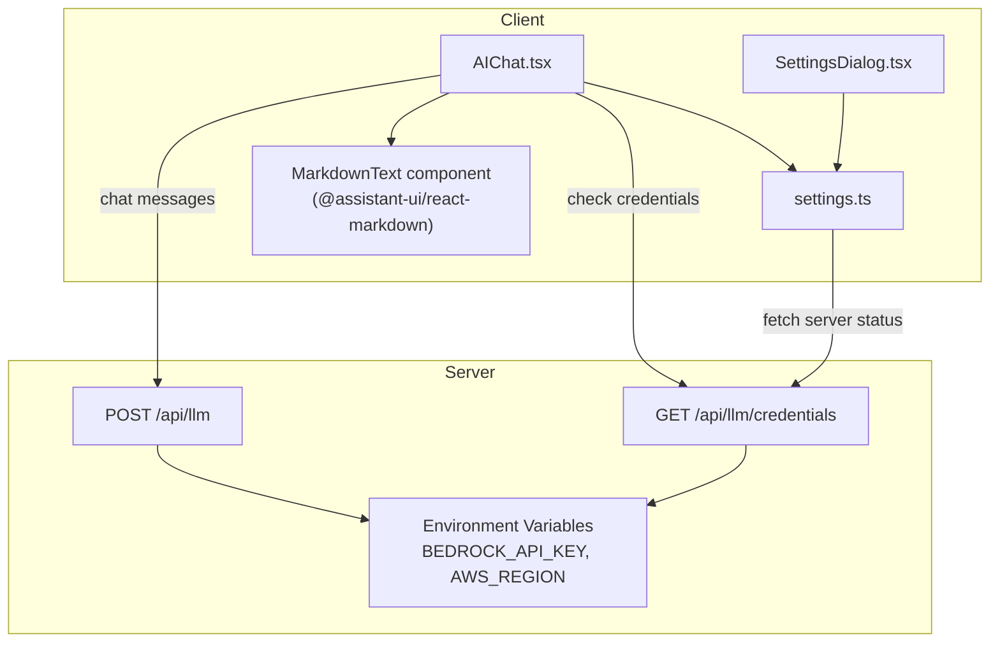

# Design Document: Chat Enhancements

## Overview

This design covers two enhancements to the form-editor's AI chat:

1. **Markdown rendering** — Convert raw markdown in LLM assistant messages into styled HTML using `@assistant-ui/react-markdown`'s `MarkdownTextPrimitive`, while preserving the existing YAML code block extraction and schema-application behavior.
2. **Server-side Bedrock credentials** — Allow administrators to set `BEDROCK_API_KEY` and `AWS_REGION` environment variables on the server. When present, the LLM API route uses those credentials for Bedrock requests, removing the need for users to enter their own. A lightweight GET endpoint exposes credential availability (not the credentials themselves) so the client can adapt the UI.

## Architecture



### Key Design Decisions

1. **`@assistant-ui/react-markdown` over raw `react-markdown`**: The project already uses `@assistant-ui/react` for the chat UI. The companion `@assistant-ui/react-markdown` package provides a `MarkdownTextPrimitive` component that integrates directly with `MessagePrimitive.Parts`. This avoids building a custom markdown wrapper and leverages the existing assistant-ui component model. It supports custom component overrides for styling and handles streaming content natively.

2. **Server credential precedence**: When both server-side and client-side Bedrock credentials exist, the server-side credentials take precedence. This ensures administrators maintain control over which credentials are used.

3. **Credential status endpoint**: A separate `GET /api/llm/credentials` route returns `{ bedrockConfigured: boolean }`. This avoids leaking secrets while letting the client adapt the UI (e.g., skip the "API Key Required" gate, show an indicator in settings).

4. **Provider auto-selection**: When server-side Bedrock credentials are available and the user has no client-side credentials configured, the system defaults to the Bedrock provider so the chat works out of the box.

## Components and Interfaces

### 1. MarkdownText Component (using @assistant-ui/react-markdown)

A new co-located component at `packages/form-editor/src/components/assistant-ui/markdown-text.tsx` that uses `MarkdownTextPrimitive` from `@assistant-ui/react-markdown`. This integrates natively with assistant-ui's `MessagePrimitive.Parts` system.

```typescript
// packages/form-editor/src/components/assistant-ui/markdown-text.tsx
"use client";

import { memo } from "react";
import { MarkdownTextPrimitive } from "@assistant-ui/react-markdown";

// Custom component overrides for styling within the chat theme
const defaultComponents = {
  p: ({ children }: any) => <p className="mb-2 last:mb-0">{children}</p>,
  ul: ({ children }: any) => <ul className="list-disc pl-4 mb-2">{children}</ul>,
  ol: ({ children }: any) => <ol className="list-decimal pl-4 mb-2">{children}</ol>,
  li: ({ children }: any) => <li className="mb-1">{children}</li>,
  h1: ({ children }: any) => <h1 className="text-lg font-bold mb-2">{children}</h1>,
  h2: ({ children }: any) => <h2 className="text-base font-bold mb-2">{children}</h2>,
  h3: ({ children }: any) => <h3 className="text-sm font-bold mb-1">{children}</h3>,
  code: ({ className, children, ...props }: any) => {
    const isInline = !className;
    if (isInline) {
      return (
        <code className="bg-slate-200 text-slate-800 px-1 py-0.5 rounded text-sm" {...props}>
          {children}
        </code>
      );
    }
    return (
      <pre className="bg-slate-800 text-slate-100 p-3 rounded-lg overflow-x-auto my-2">
        <code className={className} {...props}>{children}</code>
      </pre>
    );
  },
  a: ({ href, children }: any) => (
    <a href={href} className="text-blue-600 underline" target="_blank" rel="noopener noreferrer">
      {children}
    </a>
  ),
  blockquote: ({ children }: any) => (
    <blockquote className="border-l-4 border-slate-300 pl-3 italic my-2">{children}</blockquote>
  ),
};

const MarkdownTextImpl = () => {
  return (
    <MarkdownTextPrimitive
      className="aui-md"
      components={defaultComponents}
    />
  );
};

export const MarkdownText = memo(MarkdownTextImpl);
```

**Integration point**: In the `CustomMessage` component inside `AIChatInner`, use `MessagePrimitive.Parts` with `components={{ Text: MarkdownText }}` for assistant messages. This replaces the raw `<div className="whitespace-pre-wrap flex-1">{displayContent}</div>` with the assistant-ui markdown pipeline. User messages continue to render as plain text via the existing `<div className="whitespace-pre-wrap flex-1">`.

**New dependency**: `@assistant-ui/react-markdown` (add to `packages/form-editor/package.json`).

### 2. GET /api/llm/credentials Endpoint

A new route handler at `packages/form-editor/src/app/api/llm/credentials/route.ts`.

```typescript
import { NextResponse } from "next/server";

export async function GET() {
  const bedrockApiKey = process.env.BEDROCK_API_KEY;
  const awsRegion = process.env.AWS_REGION;

  return NextResponse.json({
    bedrockConfigured: !!(bedrockApiKey && awsRegion),
  });
}
```

### 3. Modified POST /api/llm Route

The existing `createProvider` function for the `bedrock` case gains a fallback to environment variables.

```typescript
// In the bedrock case of createProvider:
case "bedrock": {
  // Server-side credentials take precedence
  const serverApiKey = process.env.BEDROCK_API_KEY;
  const serverRegion = process.env.AWS_REGION;

  if (serverApiKey && serverRegion) {
    return createAmazonBedrock({
      region: serverRegion,
      apiKey: serverApiKey,
    });
  }

  // Fall back to client-supplied credentials (existing logic)
  const authMethod = credentials.bedrockAuthMethod || "iam";
  // ... existing code unchanged ...
}
```

The validation at the top of the POST handler also needs adjustment: when the provider is `bedrock` and server-side credentials exist, skip the client credential requirement.

### 4. Settings Manager Changes (`settings.ts`)

Add a function to fetch server credential status and a modified `hasApiKey` that accounts for server-side availability.

```typescript
// Cache the server credential status
let serverCredentialStatus: { bedrockConfigured: boolean } | null = null;

export async function fetchServerCredentialStatus(): Promise<{ bedrockConfigured: boolean }> {
  if (serverCredentialStatus !== null) {
    return serverCredentialStatus;
  }
  try {
    const response = await fetch('/api/llm/credentials');
    const data = await response.json();
    serverCredentialStatus = data;
    return data;
  } catch {
    return { bedrockConfigured: false };
  }
}

export function setServerCredentialStatus(status: { bedrockConfigured: boolean }): void {
  serverCredentialStatus = status;
}

export function getServerCredentialStatus(): { bedrockConfigured: boolean } | null {
  return serverCredentialStatus;
}
```

The existing synchronous `hasApiKey()` function is extended: if the cached server credential status shows `bedrockConfigured: true` and the current provider is `bedrock`, return `true` even without client-side credentials.

### 5. Settings Dialog Changes

When server-side Bedrock credentials are available, the Bedrock section of the Settings Dialog shows an informational banner: "Server-provided Bedrock credentials are active. You can optionally override them below." The credential input fields remain visible but are not required.

### 6. AIChat Changes

On mount, `AIChat` calls `fetchServerCredentialStatus()`. If `bedrockConfigured` is true and no client-side credentials are set, the component auto-selects the `bedrock` provider and enables the chat interface. The transport body builder skips sending client Bedrock credentials when the server has them configured.

## Data Models

### Server Credential Status Response

```typescript
interface ServerCredentialStatus {
  bedrockConfigured: boolean;
}
```

### Environment Variables

| Variable | Description | Required |
|---|---|---|
| `BEDROCK_API_KEY` | Amazon Bedrock API key for server-side auth | No (optional) |
| `AWS_REGION` | AWS region for Bedrock API calls | Required if `BEDROCK_API_KEY` is set |

### Existing Models (unchanged)

- `LLMSettings` — No schema changes. The `provider` field may be auto-set to `"bedrock"` when server credentials are detected.
- `LLMRequest` — No changes. The route handler internally resolves credentials.


## Correctness Properties

*A property is a characteristic or behavior that should hold true across all valid executions of a system — essentially, a formal statement about what the system should do. Properties serve as the bridge between human-readable specifications and machine-verifiable correctness guarantees.*

### Property 1: Markdown renders to styled elements

*For any* non-empty markdown string containing formatting syntax (bold, italic, headings, lists, links, code), when rendered through the MarkdownMessage component, the output should contain the corresponding HTML elements (e.g., `**bold**` produces a `<strong>` element, `# heading` produces an `<h1>` element).

**Validates: Requirements 1.1**

### Property 2: YAML code blocks are hidden from display

*For any* assistant message string containing a fenced YAML code block (` ```yaml ... ``` `), the `displayContent` computed by the CustomMessage component should not contain the YAML code block content, preserving the existing schema extraction behavior.

**Validates: Requirements 1.3**

### Property 3: User messages bypass markdown rendering

*For any* user message containing markdown syntax characters (e.g., `*`, `#`, `` ` ``, `[`), the rendered output should display the raw text without converting it to HTML formatting elements.

**Validates: Requirements 1.5**

### Property 4: Credential resolution selects correct source

*For any* combination of server-side environment variables (`BEDROCK_API_KEY`, `AWS_REGION`) and client-supplied Bedrock credentials, the `createProvider("bedrock", ...)` function should: (a) use server-side credentials when both env vars are set, regardless of client credentials; (b) use client-supplied credentials when server-side env vars are absent; (c) throw an error when neither server-side nor client-side credentials are available.

**Validates: Requirements 2.1, 2.2, 2.3, 2.4**

### Property 5: Credential status endpoint is correct and safe

*For any* state of the `BEDROCK_API_KEY` and `AWS_REGION` environment variables, the GET `/api/llm/credentials` endpoint should return `{ bedrockConfigured: true }` if and only if both variables are non-empty strings, and the response body should never contain the actual credential values.

**Validates: Requirements 3.1**

### Property 6: hasApiKey reflects server credential availability

*For any* `LLMSettings` with `provider: "bedrock"` and no client-side Bedrock credentials, when the cached server credential status indicates `bedrockConfigured: true`, the `hasApiKey()` function should return `true`.

**Validates: Requirements 3.3**

## Error Handling

| Scenario | Behavior |
|---|---|
| Server-side Bedrock credentials are invalid (API returns 401/403) | LLM_API_Route returns `{ error: "Authentication failed: ..." }` with status 401. Same as existing behavior for client credential failures. |
| `BEDROCK_API_KEY` is set but `AWS_REGION` is missing | Server credentials are treated as not configured; falls back to client credentials. |
| `react-markdown` receives malformed markdown | `react-markdown` handles this gracefully by rendering raw text for unparseable sections. No additional error handling needed. |
| GET `/api/llm/credentials` fails on the client | `fetchServerCredentialStatus` catches the error and returns `{ bedrockConfigured: false }`, falling back to client-only mode. |
| localStorage is unavailable or corrupted | Existing `getSettings()` error handling returns defaults. Server credential check still works independently. |

## Testing Strategy

### Unit Tests

- **MarkdownMessage component**: Render with specific markdown inputs (headings, lists, code blocks, links) and assert the correct HTML elements and CSS classes are present.
- **YAML block hiding**: Verify that `extractTextAfterYaml` and the display logic correctly strip YAML blocks from various message formats.
- **Credential status endpoint**: Test the GET handler with various env var combinations.
- **Settings Dialog**: Test that the server credential banner appears when `bedrockConfigured` is true.
- **Error responses**: Test that invalid server credentials produce the expected error format.

### Property-Based Tests

Property-based tests use `fast-check` (already in devDependencies) with a minimum of 100 iterations per property. Each test is tagged with its design property reference.

- **Property 4 (Credential resolution)**: Generate random combinations of server env vars (present/absent) and client credentials (present/absent/partial). Assert the correct credential source is selected or the correct error is thrown.
  - Tag: `Feature: chat-enhancements, Property 4: Credential resolution selects correct source`

- **Property 5 (Credential status endpoint)**: Generate random env var states (undefined, empty string, non-empty string) for both `BEDROCK_API_KEY` and `AWS_REGION`. Assert the response matches the expected boolean.
  - Tag: `Feature: chat-enhancements, Property 5: Credential status endpoint is correct and safe`

- **Property 6 (hasApiKey with server credentials)**: Generate random `LLMSettings` objects with `provider: "bedrock"` and varying client credential states. With server status cached as `bedrockConfigured: true`, assert `hasApiKey()` returns true regardless of client credential state.
  - Tag: `Feature: chat-enhancements, Property 6: hasApiKey reflects server credential availability`

Properties 1, 2, and 3 (markdown rendering, YAML hiding, user message bypass) are best validated through unit tests with specific examples rather than property-based tests, since they depend on React component rendering and DOM assertions. The markdown rendering properties would require a full DOM environment and the assertions are about specific HTML element presence rather than algebraic relationships.
