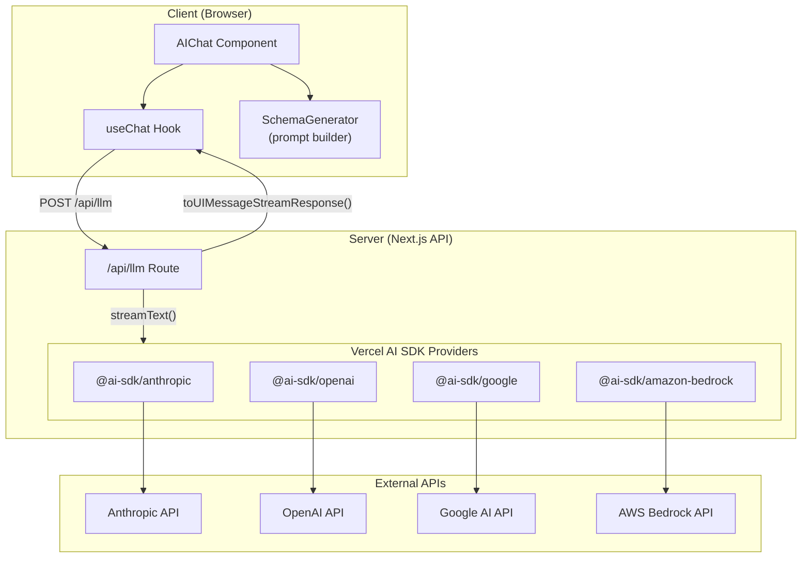
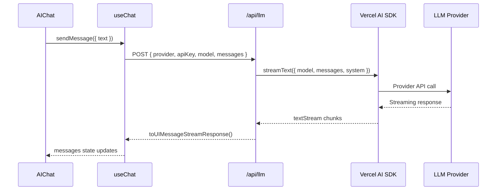

# Design Document: Vercel AI SDK Migration

## Overview

This design describes the migration from a custom LLM client implementation to the Vercel AI SDK (`ai` package) in the form-editor application. The migration replaces manual SSE parsing with the SDK's built-in streaming abstractions (`streamText`, `textStream`) and enables easy switching between multiple LLM providers (Anthropic, OpenAI, Google, Amazon Bedrock).

The key architectural change is moving provider-specific logic to the server-side API route, where the Vercel AI SDK handles streaming responses. The client-side LLM client becomes a thin wrapper that fetches from the API route and parses the text stream.

## Architecture



### Key Design Decisions

1. **Server-side provider instantiation**: Provider instances are created in the API route using credentials from the request body. This keeps API keys secure and allows runtime provider switching.

2. **Use SDK's `useChat` hook**: The Vercel AI SDK provides `useChat` from `@ai-sdk/react` which handles chat state, streaming, and message management. This replaces the custom `LLMClient` interface and simplifies the `AIChat` component significantly.

3. **Unified streaming protocol**: The API route uses `toUIMessageStreamResponse()` to return a stream compatible with `useChat`, eliminating manual SSE parsing.

4. **Simplified architecture**: By using `useChat`, we remove the need for:
   - Custom `LLMClient` interface and `createAnthropicClient` function
   - Manual async iteration over streams in `SchemaGenerator`
   - Custom message state management in `AIChat`

5. **Provider-agnostic settings**: Settings store provider type and credentials separately, supporting different authentication patterns (API key vs AWS credentials).

## Components and Interfaces

### Approach: Using `useChat` Hook

The Vercel AI SDK provides `useChat` from `@ai-sdk/react` which handles:
- Chat message state management
- Streaming response handling
- Automatic UI updates as chunks arrive
- Error handling

This eliminates the need for the custom `LLMClient` interface entirely.

### API Route (`/api/llm/route.ts`)

The API route handles provider instantiation and streaming.

```typescript
import { streamText } from 'ai';
import { createAnthropic } from '@ai-sdk/anthropic';
import { createOpenAI } from '@ai-sdk/openai';
import { createGoogleGenerativeAI } from '@ai-sdk/google';
import { createAmazonBedrock } from '@ai-sdk/amazon-bedrock';

interface LLMRequest {
  provider: LLMProvider;
  apiKey?: string;
  model: string;
  messages: Array<{ role: string; content: string }>;
  system?: string;
  maxTokens?: number;
  // AWS Bedrock specific
  awsAccessKeyId?: string;
  awsSecretAccessKey?: string;
  awsRegion?: string;
}

export async function POST(request: Request): Promise<Response>;
```

**Implementation approach**:
- Parse request body to extract provider, credentials, and messages
- Create provider instance using appropriate factory function
- Call `streamText()` with the provider's model and messages
- Return `result.toUIMessageStreamResponse()` for compatibility with `useChat`

### AIChat Component (Refactored)

The `AIChat` component is significantly simplified using `useChat`:

```typescript
'use client';

import { useChat } from '@ai-sdk/react';
import { DefaultChatTransport } from 'ai';

export default function AIChat({ onSchemaGenerated }: AIChatProps) {
  const { messages, sendMessage, status, error } = useChat({
    transport: new DefaultChatTransport({
      api: '/api/llm',
      // Pass credentials via headers or body
    }),
  });

  // Extract YAML from assistant messages and call onSchemaGenerated
  // ...
}
```

### SchemaGenerator (Simplified)

The `SchemaGenerator` class can be simplified or potentially removed, as `useChat` handles:
- Conversation history management
- Streaming response accumulation
- Message state updates

If we keep `SchemaGenerator`, it becomes a thin wrapper for building prompts:

```typescript
export class SchemaGenerator {
  private catalogPrompt: string;

  constructor() {
    const catalog = getRegisteredCatalog();
    this.catalogPrompt = generateCatalogPrompt(catalog, { includeExamples: true });
  }

  getSystemPrompt(): string {
    return this.catalogPrompt;
  }

  buildEditPrompt(currentSchema: string, instructions: string): string {
    return `Here is the current schema:\n\`\`\`yaml\n${currentSchema}\n\`\`\`\n\nPlease modify it: ${instructions}`;
  }
}
```

### Settings Storage (`settings.ts`)

Extended to support multiple providers and AWS credentials.

```typescript
export type LLMProvider = "anthropic" | "openai" | "google" | "bedrock";

export interface LLMSettings {
  provider: LLMProvider;
  apiKey?: string;
  model?: string;
  // AWS Bedrock specific
  awsAccessKeyId?: string;
  awsSecretAccessKey?: string;
  awsRegion?: string;
}

export const DEFAULT_MODELS: Record<LLMProvider, string> = {
  anthropic: "claude-sonnet-4-20250514",
  openai: "gpt-4o",
  google: "gemini-2.0-flash",
  bedrock: "anthropic.claude-3-sonnet-20240229-v1:0",
};

export function getSettings(): LLMSettings;
export function saveSettings(settings: LLMSettings): void;
export function hasApiKey(): boolean;
```

### Provider Factory Functions

Each provider uses its SDK factory function:

| Provider | Package | Factory Function | Auth |
|----------|---------|------------------|------|
| Anthropic | `@ai-sdk/anthropic` | `createAnthropic({ apiKey })` | API Key |
| OpenAI | `@ai-sdk/openai` | `createOpenAI({ apiKey })` | API Key |
| Google | `@ai-sdk/google` | `createGoogleGenerativeAI({ apiKey })` | API Key |
| Bedrock | `@ai-sdk/amazon-bedrock` | `createAmazonBedrock({ region, accessKeyId, secretAccessKey })` | AWS Credentials |

## Data Models

### Request/Response Flow



### Settings Data Structure

```typescript
// Stored in localStorage as JSON
interface StoredSettings {
  provider: "anthropic" | "openai" | "google" | "bedrock";
  apiKey?: string;           // For Anthropic, OpenAI, Google
  model?: string;            // Provider-specific model ID
  awsAccessKeyId?: string;   // For Bedrock
  awsSecretAccessKey?: string; // For Bedrock
  awsRegion?: string;        // For Bedrock (e.g., "us-east-1")
}
```

### API Request Body

```typescript
interface APIRequestBody {
  provider: LLMProvider;
  model: string;
  messages: Array<{
    role: "user" | "assistant";
    content: string;
  }>;
  system?: string;           // System prompt (extracted from messages)
  maxTokens?: number;
  // Credentials (provider-specific)
  apiKey?: string;
  awsAccessKeyId?: string;
  awsSecretAccessKey?: string;
  awsRegion?: string;
}
```


## Correctness Properties

*A property is a characteristic or behavior that should hold true across all valid executions of a system—essentially, a formal statement about what the system should do. Properties serve as the bridge between human-readable specifications and machine-verifiable correctness guarantees.*

Based on the prework analysis and the updated architecture using `useChat`, the following properties have been identified:

### Property 1: Settings Round-Trip Consistency

*For any* valid `LLMSettings` object containing provider, apiKey, model, and AWS credentials (for Bedrock), saving the settings and then loading them SHALL return an equivalent object with all fields preserved.

**Validates: Requirements 3.5, 3.7, 7.1, 7.2, 7.3**

### Property 2: Default Model Selection

*For any* provider in the set {anthropic, openai, google, bedrock}, when no model is specified in the configuration, the settings SHALL return the predefined default model for that provider.

**Validates: Requirements 3.6**

### Property 3: Invalid Request Error Handling

*For any* API request missing required fields (provider, credentials for the selected provider), the API route SHALL return an HTTP error response with status code 400.

**Validates: Requirements 4.4**

### Property 4: Settings Validation and Corruption Handling

*For any* corrupted JSON string or invalid settings object in localStorage (invalid provider value, missing required fields), loading settings SHALL return the default settings object without throwing an error.

**Validates: Requirements 7.4, 7.5**

### Property 5: Provider Factory Selection

*For any* valid provider value, the API route SHALL create the correct provider instance using the appropriate SDK factory function (createAnthropic, createOpenAI, createGoogleGenerativeAI, createAmazonBedrock).

**Validates: Requirements 3.1, 3.2, 3.3, 3.4**

## Error Handling

### Client-Side Errors

| Error Type | Detection | Response |
|------------|-----------|----------|
| Network Error | `fetch` throws | Throw `Error("Network error: Unable to connect to LLM service")` |
| HTTP 401 | `response.status === 401` | Throw `Error("Authentication failed: Please check your API key")` |
| HTTP 429 | `response.status === 429` | Throw `Error("Rate limit exceeded: Please wait before retrying")` |
| HTTP 5xx | `response.status >= 500` | Throw `Error("Server error: The LLM service is temporarily unavailable")` |
| Other HTTP errors | `!response.ok` | Throw `Error("API error ({status}): {errorText}")` |

### Server-Side Errors (API Route)

| Error Type | Detection | Response |
|------------|-----------|----------|
| Missing provider | `!body.provider` | Return `{ error: "Provider is required" }` with status 400 |
| Missing credentials | Provider-specific check | Return `{ error: "API key is required" }` or `{ error: "AWS credentials are required" }` with status 400 |
| Invalid provider | Provider not in allowed list | Return `{ error: "Unsupported provider" }` with status 400 |
| SDK error | `streamText` throws | Return `{ error: error.message }` with status 500 |

### Settings Errors

| Error Type | Detection | Response |
|------------|-----------|----------|
| Corrupted JSON | `JSON.parse` throws | Return `DEFAULT_SETTINGS` |
| Invalid provider | Provider not in allowed list | Return `DEFAULT_SETTINGS` |
| Storage quota exceeded | `localStorage.setItem` throws | Throw `Error("Failed to save settings. Storage may be full.")` |

## Testing Strategy

### Unit Tests

Unit tests verify specific examples and edge cases:

1. **Settings storage**: Test save/load with specific provider configurations
2. **Error handling**: Test specific error scenarios (401, 429, 500 responses)
3. **Default models**: Test that each provider returns its expected default model
4. **Provider factory**: Test that correct provider is instantiated for each provider type

### Property-Based Tests

Property tests verify universal properties across generated inputs using `fast-check`:

1. **Settings round-trip** (Property 1): Generate random valid settings, save, load, compare
2. **Default model selection** (Property 2): Generate random providers, verify default model
3. **Invalid request handling** (Property 3): Generate requests with missing fields, verify 400 response
4. **Settings validation** (Property 4): Generate corrupted/invalid settings, verify defaults returned

### Test Configuration

- **Library**: `fast-check` (already in devDependencies)
- **Minimum iterations**: 100 per property test
- **Tag format**: `Feature: vercel-ai-sdk-migration, Property {N}: {property_text}`

### Integration Tests

Integration tests verify component interactions:

1. **AIChat with useChat**: Verify streaming updates UI correctly
2. **API route**: Verify end-to-end request/response flow (requires mock LLM)
3. **YAML extraction**: Verify schema extraction from streamed responses

### Test File Structure

```
packages/form-editor/src/lib/
├── __tests__/
│   ├── settings.test.ts        # Unit + property tests for settings
│   └── api-route.test.ts       # API route tests
```
