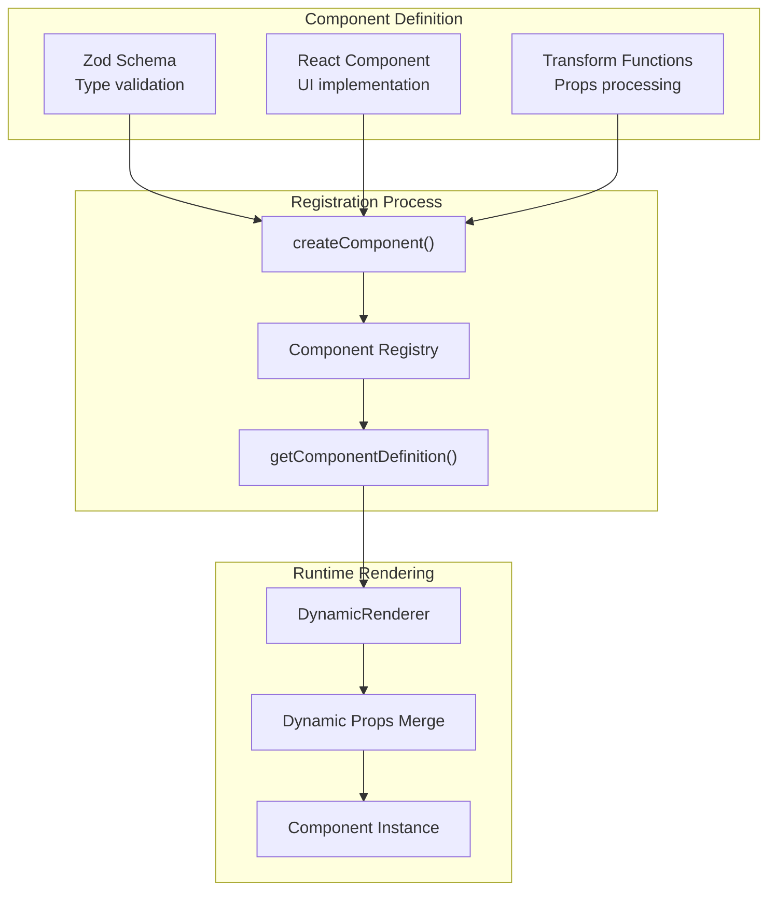
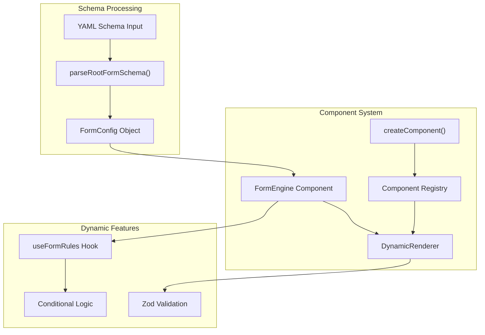
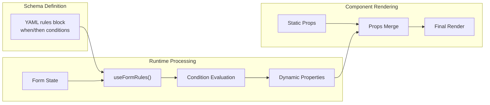

# Form Engine - Schema-Driven Dynamic Forms

A proof-of-concept monorepo demonstrating schema-driven form rendering using React and [Radix UI](https://www.radix-ui.com/primitives).  Parse YAML form definitions and dynamically render interactive, multi-step web forms with conditional logic, validation, and extensible component architecture.


## 🚀 Quick Start

```bash
# Install dependencies
npm install

# Start the form editor with live preview
npm run dev

# Or try other applications
npm run dev:form-preview     # Vite-based preview to run inside VS Code while editing a YAML schema
npm run dev:schema-viewer    # Demo application
```


## 🛠️ Technology Stack

- **Frontend**: React 19, Next.js 15 (app router)
- **Language**: TypeScript for type safety
- **Schema**: YAML with `js-yaml` parsing
- **Validation**: Zod schemas
- **UI Components**: Radix UI primitives
- **Styling**: Tailwind CSS
- **Build**: npm workspaces, Vite


## 📦 Monorepo Structure

| Package | Purpose | Technology |
|---------|---------|------------|
| **form-engine** | Core rendering library | React, TypeScript, Zod |
| **form-editor** | Schema editor with live preview | Next.js, Monaco Editor |
| **schema-viewer** | Demo application | Next.js |
| **form-preview** | Standalone form preview | Vite |


## ✨ Core Features

See [DeepWiki](https://deepwiki.com/fwextensions/form-engine-poc/1-overview) for more details about the package's architecture.

### Schema-Driven Forms
- **YAML Configuration**: Declarative form definitions
- **Component Factory**: Dynamic component registration via [`createComponent()`](/packages/form-engine/src/core/componentFactory.ts#L35-66)
- **Type Safety**: Zod-based validation and TypeScript integration


### Dynamic Behavior
- **Rules Engine**: Conditional logic with [`useFormRules`](/packages/form-engine/src/hooks/useFormRules.ts#L58-122) hook
- **Multi-Step Navigation**: Page-based forms with validation
- **Field Preprocessing**: Automatic required field detection (asterisk notation)


### Component Library
Standard form components with Radix UI primitives:
- **Field Components**: Text, Email, Select, Checkbox, Radio, Date, Textarea
- **Layout Components**: Form, Page, HTML content blocks


## 🔧 Component Registration System

The form engine uses a factory pattern for component registration:



Example component registration: [Checkbox.tsx](/packages/form-engine/src/components/fields/Checkbox.tsx#L74-99)


## 🏗️ Architecture Overview

The form-engine follows a component-driven architecture with centralized schema processing:




## 🎯 Rules Engine

Dynamic form behavior through centralized conditional logic:



Example conditional logic: [schema.yaml](/packages/form-preview/schema.yaml#L101-107)


## 📋 Example Schema

```yaml
title: Contact Form
id: contact
type: form
children:
  - id: personalInfo
    type: page
    title: Personal Information
    children:
      - id: fullName
        type: text
        label: Full Name*

      - id: email
        type: email
        label: Email Address*

  - id: preferences
    type: page
    title: Preferences
    children:
      - id: newsletter
        type: checkbox
        label: Subscribe to newsletter

      - id: topics
        type: text
        label: Interested topics
        hidden: true
        rules:
          - when:
              field: newsletter
              is: true
            then:
              - set:
                  hidden: false
```


## 🚀 Development

### Adding New Components

1. **Create component file** in `packages/form-engine/src/components/`
2. **Define Zod schema** for type validation
3. **Implement React component** with proper props interface
4. **Register with factory**: Call `createComponent()`
5. **Export from index**: Add to component exports [components/index.ts](/packages/form-engine/src/components/index.ts)


### Build Process

The `form-engine` package doesn't currently output a proper reusable package.  It's only used by other packages like `form-preview` in the monorepo.

```bash
npm run generate-schema  # Generate JSON schema from all of the components' Zod definitions
npm run build            # Build TypeScript to dist/
```


## 📚 Documentation

- **Detailed Specification**: See [`docs/spec.md`](/docs/spec.md) for implementation milestones
- **Form Editor Guide**: See [`docs/form-editor-spec.md`](/docs/form-editor-spec.md) for editor development
- **Component Development**: See wiki for extending the component system


## 🎯 Future Development

Refer to the [`docs/`](/docs) directory for detailed feature roadmaps, milestones, and planned enhancements including advanced validation, internationalization, and plugin architecture.


## ⚠️ Limitations

[Devin noted](https://deepwiki.com/search/take-a-look-at-the-files-that_155ccf08-e637-44d5-be08-3a71e305d838) that the current JSON schema has several limitations for representing the full DAHLIA short form:

* **Complex date fields**: The form uses separate `MM/DD/YYYY` inputs with custom validation `c3-household-member-form.html.slim:28-41`

* **Address validation**: Requires integration with address validation services `ShortFormApplicationController.js.coffee:41-42`

* **Dynamic household members**: The form allows adding/removing household members dynamically, which requires array field management not supported by the schema

* **Conditional field display**: Many fields show/hide based on other field values using complex rules `c3-household-member-form.html.slim:58-60`

* **File uploads**: Preference documentation requires file uploads with specific document type categorization

* **Multi-field address components**: Addresses require separate fields for address1, address2, city, state, zip with validation

The schema would also need extensions for dynamic arrays, complex conditional logic, file uploads, and multi-component field types to fully represent the DAHLIA form structure.
