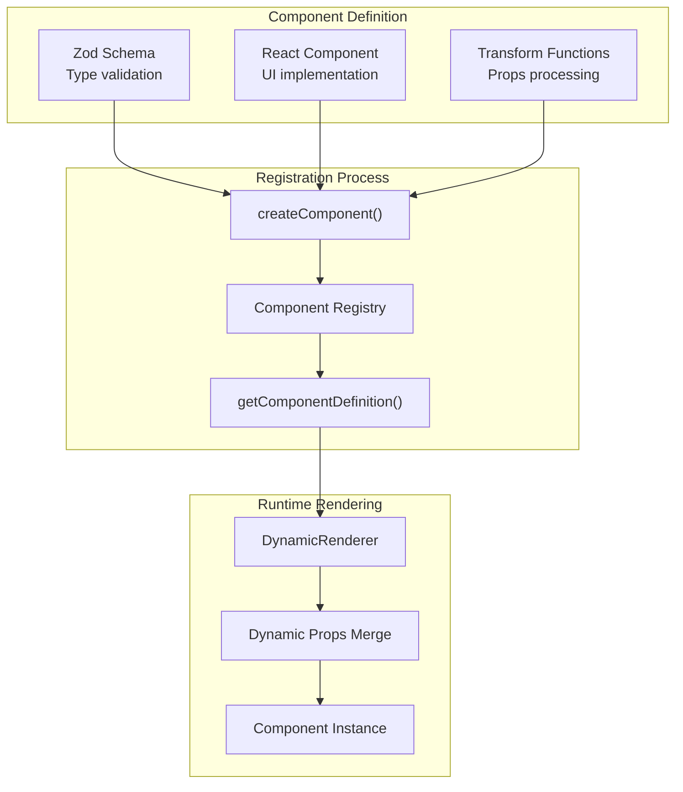
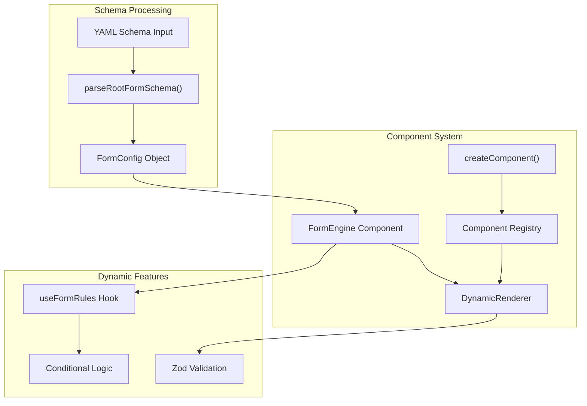
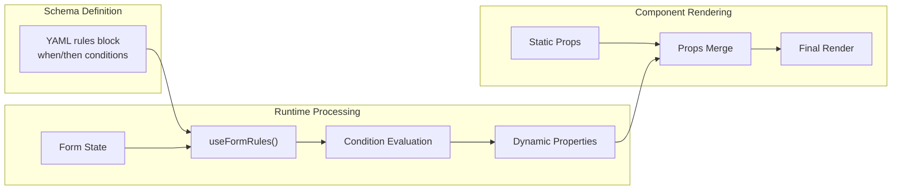
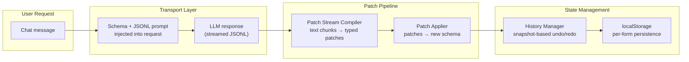

# Form Engine - Schema-Driven Dynamic Forms

A proof-of-concept monorepo demonstrating schema-driven form rendering using React and [Radix UI](https://www.radix-ui.com/primitives).  Parse YAML form definitions and dynamically render interactive, multi-step web forms with conditional logic, validation, and extensible component architecture.


## 🚀 Quick Start

```bash
# Install dependencies
npm install

# Start the form editor with live preview
npm run dev

# Or try other applications
npm run dev:form-preview     # Vite-based preview to run inside VS Code while editing a YAML schema
npm run dev:schema-viewer    # Demo application
```


## 🛠️ Technology Stack

- **Frontend**: React 19, Next.js 16 (app router)
- **Language**: TypeScript for type safety
- **Schema**: YAML with `js-yaml` parsing
- **Validation**: Zod schemas
- **UI Components**: Radix UI primitives
- **Styling**: Tailwind CSS
- **Build**: npm workspaces, Vite


## 📦 Monorepo Structure

| Package | Purpose | Technology |
|---------|---------|------------|
| **form-engine** | Core rendering library | React, TypeScript, Zod |
| **form-editor** | Schema editor with live preview | Next.js, Monaco Editor |
| **schema-viewer** | Demo application | Next.js |
| **form-preview** | Standalone form preview | Vite |


## ✨ Core Features

See [DeepWiki](https://deepwiki.com/fwextensions/form-engine-poc/1-overview) for more details about the package's architecture.

### Schema-Driven Forms
- **YAML Configuration**: Declarative form definitions
- **Component Factory**: Dynamic component registration via [`createComponent()`](/packages/form-engine/src/core/componentFactory.ts#L35-66)
- **Type Safety**: Zod-based validation and TypeScript integration


### Dynamic Behavior
- **Rules Engine**: Conditional logic with [`useFormRules`](/packages/form-engine/src/hooks/useFormRules.ts#L58-122) hook
- **Multi-Step Navigation**: Page-based forms with validation
- **Field Preprocessing**: Automatic required field detection (asterisk notation)


### Component Library
Standard form components with Radix UI primitives:
- **Field Components**: Text, Email, Select, Checkbox, Radio, Date, Textarea
- **Layout Components**: Form, Page, HTML content blocks


## 🔧 Component Registration System

The form engine uses a factory pattern for component registration:


```mermaid
graph TD
    subgraph "Component Definition"
        SCHEMA["Zod Schema<br/>Type validation"]
        COMPONENT["React Component<br/>UI implementation"]
        TRANSFORMS["Transform Functions<br/>Props processing"]
    end

    subgraph "Registration Process"
        CREATE["createComponent()"]
        REGISTRY["Component Registry"]
        LOOKUP["getComponentDefinition()"]
    end

    subgraph "Runtime Rendering"
        DYNAMIC["DynamicRenderer"]
        PROPS["Dynamic Props Merge"]
        RENDER["Component Instance"]
    end

    SCHEMA --> CREATE
    COMPONENT --> CREATE
    TRANSFORMS --> CREATE
    CREATE --> REGISTRY
    REGISTRY --> LOOKUP
    LOOKUP --> DYNAMIC
    DYNAMIC --> PROPS
    PROPS --> RENDER
```

Example component registration: [Checkbox.tsx](/packages/form-engine/src/components/fields/Checkbox.tsx#L74-99)


## 🏗️ Architecture Overview

The form-engine follows a component-driven architecture with centralized schema processing:


```mermaid
graph TB
    subgraph "Schema Processing"
        YAML["YAML Schema Input"]
        PARSER["parseRootFormSchema()"]
        CONFIG["FormConfig Object"]

        YAML --> PARSER
        PARSER --> CONFIG
    end

    subgraph "Component System"
        FACTORY["createComponent()"]
        REGISTRY["Component Registry"]
        ENGINE["FormEngine Component"]
        RENDERER["DynamicRenderer"]

        FACTORY --> REGISTRY
        CONFIG --> ENGINE
        ENGINE --> RENDERER
        REGISTRY --> RENDERER
    end

    subgraph "Dynamic Features"
        RULES["useFormRules Hook"]
        CONDITIONAL["Conditional Logic"]
        VALIDATION["Zod Validation"]

        RULES --> CONDITIONAL
        ENGINE --> RULES
        RENDERER --> VALIDATION
    end
```


## 🎯 Rules Engine

Dynamic form behavior through centralized conditional logic:


```mermaid
flowchart LR
    subgraph "Schema Definition"
        YAML_RULES["YAML rules block<br/>when/then conditions"]
    end

    subgraph "Runtime Processing"
        FORM_DATA["Form State"]
        RULES_HOOK["useFormRules()"]
        EVALUATION["Condition Evaluation"]
        DYNAMIC_PROPS["Dynamic Properties"]
    end

    subgraph "Component Rendering"
        STATIC["Static Props"]
        MERGE["Props Merge"]
        FINAL["Final Render"]
    end

    YAML_RULES --> RULES_HOOK
    FORM_DATA --> RULES_HOOK
    RULES_HOOK --> EVALUATION
    EVALUATION --> DYNAMIC_PROPS

    STATIC --> MERGE
    DYNAMIC_PROPS --> MERGE
    MERGE --> FINAL
```

Example conditional logic: [schema.yaml](/packages/form-preview/schema.yaml#L101-107)


## 📋 Example Schema

```yaml
title: Contact Form
id: contact
type: form
children:
  - id: personalInfo
    type: page
    title: Personal Information
    children:
      - id: fullName
        type: text
        label: Full Name*

      - id: email
        type: email
        label: Email Address*

  - id: preferences
    type: page
    title: Preferences
    children:
      - id: newsletter
        type: checkbox
        label: Subscribe to newsletter

      - id: topics
        type: text
        label: Interested topics
        hidden: true
        rules:
          - when:
              field: newsletter
              is: true
            then:
              - set:
                  hidden: false
```


## 🔄 JSONL Patch Transport

The form-editor supports an alternative AI interaction mode inspired by [Vercel Labs' json-render](https://github.com/vercel-labs/json-render). Instead of the LLM generating a complete YAML schema on every request, it outputs **JSONL (JSON Lines) patches** — one operation per line — that are applied incrementally to the current schema. This enables undo/redo, per-form chat history, and more efficient schema updates.

### How It Works


```mermaid
flowchart LR
    subgraph "User Request"
        MSG["Chat message"]
    end

    subgraph "Transport Layer"
        PROMPT["Schema + JSONL prompt<br/>injected into request"]
        LLM["LLM response<br/>(streamed JSONL)"]
    end

    subgraph "Patch Pipeline"
        COMPILER["Patch Stream Compiler<br/>text chunks → typed patches"]
        APPLIER["Patch Applier<br/>patches → new schema"]
    end

    subgraph "State Management"
        HISTORY["History Manager<br/>snapshot-based undo/redo"]
        STORAGE["localStorage<br/>per-form persistence"]
    end

    MSG --> PROMPT
    PROMPT --> LLM
    LLM --> COMPILER
    COMPILER --> APPLIER
    APPLIER --> HISTORY
    HISTORY --> STORAGE
```

### Patch Operations

Each line in the LLM response is a JSON object with an `op` field:

| Operation | Purpose | Key Fields |
|-----------|---------|------------|
| `add` | Insert a new component | `parentId`, `component`, `position?` |
| `update` | Modify an existing component's props | `id`, `props` |
| `remove` | Delete a component by ID | `id` |
| `move` | Relocate a component to a new parent | `id`, `newParentId`, `position?` |
| `replace` | Replace the entire schema | `schema` |
| `message` | Human-readable explanation (not a schema change) | `text` |

Example LLM response:

```jsonl
{"op":"add","parentId":"contactPage","component":{"type":"email","id":"userEmail","label":"Email Address*"}}
{"op":"update","id":"fullName","props":{"label":"Full Name*","placeholder":"Enter your name"}}
{"op":"remove","id":"legacyField"}
{"op":"message","text":"Added an email field and updated the name field label."}
```

### Pipeline Components

The JSONL system lives in [`packages/form-editor/src/lib/jsonl/`](/packages/form-editor/src/lib/jsonl/) and consists of:

- **[`types.ts`](/packages/form-editor/src/lib/jsonl/types.ts)** — TypeScript types for all patch operations, `PatchGroup` (wraps a set of patches with metadata and snapshots), and `SchemaComponent` (the internal JSON tree structure)
- **[`patch-compiler.ts`](/packages/form-editor/src/lib/jsonl/patch-compiler.ts)** — Stateful stream compiler that accumulates text chunks from the LLM and yields parsed, validated patch operations line-by-line. Handles SSE prefixes, markdown code fences, and partial lines
- **[`patch-applier.ts`](/packages/form-editor/src/lib/jsonl/patch-applier.ts)** — Immutable tree operations that apply patches to a `SchemaComponent` tree. Finds components by `id`, handles parent-child relationships, returns success/error per operation
- **[`history.ts`](/packages/form-editor/src/lib/jsonl/history.ts)** — Snapshot-based undo/redo manager (see below)
- **[`prompt.ts`](/packages/form-editor/src/lib/jsonl/prompt.ts)** — System prompt instructing the LLM to output JSONL patches, with format examples and rules
- **[`schema-generator.ts`](/packages/form-editor/src/lib/jsonl/schema-generator.ts)** — Combines the component catalog documentation from form-engine with the JSONL preamble into a single system prompt
- **[`chat-transport.ts`](/packages/form-editor/src/lib/jsonl/chat-transport.ts)** — Custom AssistantUI transport that intercepts requests, injects the current schema as JSON + JSONL instructions, and handles provider credential injection

### Undo/Redo

The [`history.ts`](/packages/form-editor/src/lib/jsonl/history.ts) module provides a snapshot-based history manager:

- Each history entry stores a `PatchGroup` containing the patches, a description, and **before/after schema snapshots**
- Undo and redo are **O(1)** — just restore the stored snapshot, no inverse patch computation needed
- The stack supports up to 50 entries (configurable) with automatic truncation
- Manual YAML edits are captured as history entries when switching from the YAML tab to the AI tab
- History is serialized to localStorage per form, so undo/redo state persists across form switches and page reloads

```typescript
const manager = createHistoryManager(initialSchema);

// After applying patches from the LLM:
manager.push(patchGroup);

// Undo/redo:
const prev = manager.undo();  // returns previous schema snapshot
const next = manager.redo();  // returns next schema snapshot

// Persistence:
const serialized = manager.serialize();  // save to localStorage
manager.restore(serialized);              // restore from localStorage
```

### Per-Form Chat Persistence

Chat conversations and undo/redo history are stored separately for each form in localStorage via [`chat-storage.ts`](/packages/form-editor/src/lib/chat-storage.ts). When switching between forms:

1. The current form's chat messages and history are saved
2. The new form's saved messages and history are loaded (if any)
3. The chat component remounts with the restored conversation

### JSONL Display in Chat

Raw JSONL from LLM responses is not shown to the user. The [`jsonl-display.ts`](/packages/form-editor/src/lib/jsonl-display.ts) utility detects JSONL content in assistant messages and extracts the human-readable `message` operation text for display, along with a count of schema changes applied.


## 🚀 Development

### Adding New Components

1. **Create component file** in `packages/form-engine/src/components/`
2. **Define Zod schema** for type validation
3. **Implement React component** with proper props interface
4. **Register with factory**: Call `createComponent()`
5. **Export from index**: Add to component exports [components/index.ts](/packages/form-engine/src/components/index.ts)


### Build Process

The `form-engine` package doesn't currently output a proper reusable package.  It's only used by other packages like `form-preview` in the monorepo.

```bash
npm run generate-schema  # Generate JSON schema from all of the components' Zod definitions
npm run build            # Build TypeScript to dist/
```


## 📚 Documentation

- **Detailed Specification**: See [`docs/spec.md`](/docs/spec.md) for implementation milestones
- **Form Editor Guide**: See [`docs/form-editor-spec.md`](/docs/form-editor-spec.md) for editor development
- **Component Development**: See wiki for extending the component system


## 🎯 Future Development

Refer to the [`docs/`](/docs) directory for detailed feature roadmaps, milestones, and planned enhancements including advanced validation, internationalization, and plugin architecture.


## ⚠️ Limitations

[Devin noted](https://deepwiki.com/search/take-a-look-at-the-files-that_155ccf08-e637-44d5-be08-3a71e305d838) that the current JSON schema has several limitations for representing the full DAHLIA short form:

* **Complex date fields**: The form uses separate `MM/DD/YYYY` inputs with custom validation `c3-household-member-form.html.slim:28-41`

* **Address validation**: Requires integration with address validation services `ShortFormApplicationController.js.coffee:41-42`

* **Dynamic household members**: The form allows adding/removing household members dynamically, which requires array field management not supported by the schema

* **Conditional field display**: Many fields show/hide based on other field values using complex rules `c3-household-member-form.html.slim:58-60`

* **File uploads**: Preference documentation requires file uploads with specific document type categorization

* **Multi-field address components**: Addresses require separate fields for address1, address2, city, state, zip with validation

The schema would also need extensions for dynamic arrays, complex conditional logic, file uploads, and multi-component field types to fully represent the DAHLIA form structure.
