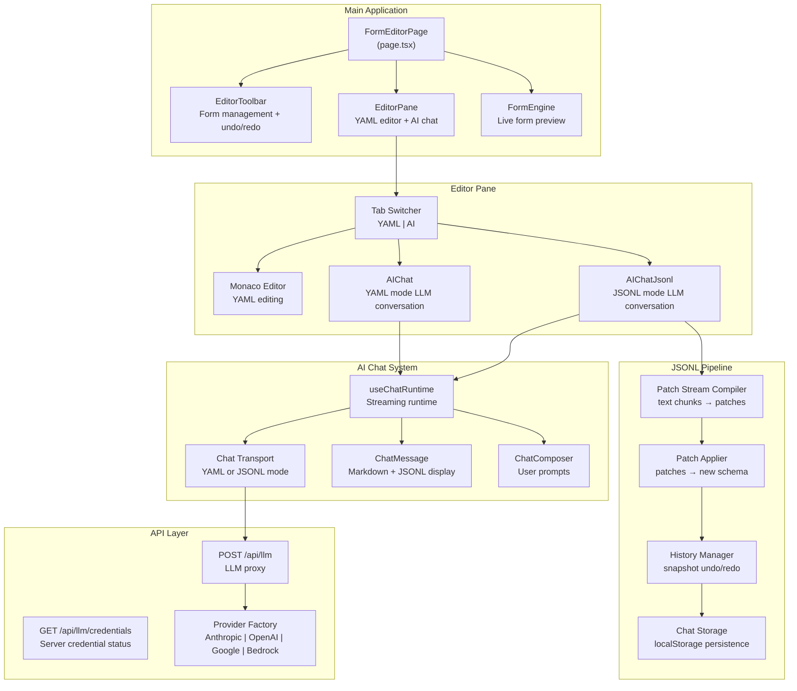
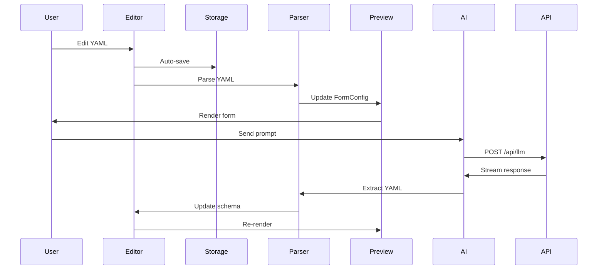
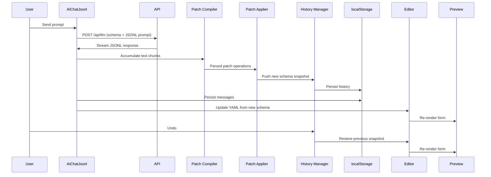

# Form Editor

An interactive schema editor for the Form Engine with live preview, AI-powered schema generation, and multi-provider LLM support.

## Overview

The Form Editor is a Next.js application that provides a split-pane interface for editing YAML form schemas with real-time preview. It features an AI assistant powered by multiple LLM providers (Anthropic, OpenAI, Google, Amazon Bedrock) that can generate and modify form schemas through natural language conversation.

## Features

### 🎨 Interactive Schema Editor
- **Monaco Editor Integration**: Full-featured code editor with YAML syntax highlighting
- **Live Preview**: Real-time form rendering as you edit the schema
- **Split-Pane Layout**: Resizable panels for editor and preview
- **Multi-Form Management**: Create, save, and switch between multiple form schemas
- **Error Display**: Inline validation errors with schema preservation

### 🤖 AI-Powered Schema Generation
- **Two AI Modes**: YAML mode (complete schema replacement) and JSONL mode (incremental patch operations)
- **Natural Language Interface**: Describe forms in plain English
- **Multi-Provider Support**: Choose from Anthropic Claude, OpenAI GPT, Google Gemini, or Amazon Bedrock
- **Streaming Responses**: Real-time markdown-formatted responses with syntax highlighting
- **Schema Validation**: Automatic validation and error reporting for generated schemas
- **Context-Aware Editing**: AI understands the current schema when making modifications
- **JSONL Patch Transport**: LLM outputs incremental JSON Lines patches instead of complete YAML (see [JSONL Patch Transport](#-jsonl-patch-transport) below)

### 🔄 Undo/Redo
- **Snapshot-Based History**: O(1) undo and redo via before/after schema snapshots
- **Per-Form Persistence**: History stack saved to localStorage per form
- **Manual Edit Tracking**: YAML edits captured as history entries on tab switch
- **Toolbar Controls**: Undo/redo buttons with tooltip descriptions in the editor toolbar

### 💬 Per-Form Chat Persistence
- **Separate Conversations**: Each form maintains its own chat history
- **localStorage Backed**: Conversations persist across page reloads and form switches
- **Automatic Save/Restore**: Messages saved on form switch, restored when returning

### 🔐 Flexible Authentication
- **Client-Side Credentials**: Store API keys locally in browser localStorage
- **Server-Side Credentials**: Optional environment variable configuration for Bedrock
- **Credential Status API**: Transparent indication of server-provided credentials
- **Multiple Auth Methods**: Support for IAM and API key authentication (Bedrock)

### 💾 Local Storage
- **Persistent Forms**: All forms saved to browser localStorage
- **Auto-Save**: Changes automatically saved as you type
- **Form Management**: Create, rename, and delete forms
- **Default Schema**: Sample form provided on first launch

## Architecture

### Technology Stack

| Layer | Technology | Purpose |
|-------|-----------|---------|
| **Framework** | Next.js 16 (App Router) | Server-side rendering, API routes |
| **Language** | TypeScript 5 | Type safety and developer experience |
| **UI Library** | React 19 | Component-based UI |
| **Styling** | Tailwind CSS 4 | Utility-first styling |
| **Editor** | Monaco Editor | Code editing with IntelliSense |
| **AI Chat** | @assistant-ui/react | Chat interface with streaming support |
| **LLM Integration** | Vercel AI SDK | Unified API for multiple LLM providers |
| **Schema Parsing** | js-yaml | YAML to JavaScript object conversion |
| **Validation** | Zod | Runtime type validation |
| **Testing** | Vitest + Testing Library | Unit and integration tests |
| **Property Testing** | fast-check | Property-based testing for correctness |

### Component Architecture



### Data Flow

#### YAML Mode (original)



#### JSONL Mode



## File Structure

```
packages/form-editor/
├── src/
│   ├── app/
│   │   ├── api/
│   │   │   └── llm/
│   │   │       ├── route.ts              # LLM proxy endpoint
│   │   │       └── credentials/
│   │   │           └── route.ts          # Credential status endpoint
│   │   ├── page.tsx                      # Main application page
│   │   ├── layout.tsx                    # Root layout
│   │   ├── globals.css                   # Global styles
│   │   └── default-yaml.ts              # Default form schema
│   │
│   ├── components/
│   │   ├── AIChat.tsx                    # YAML-mode AI chat interface
│   │   ├── AIChatJsonl.tsx              # JSONL-mode AI chat interface
│   │   ├── EditorPane.tsx               # Editor + AI tabs (supports both modes)
│   │   ├── EditorToolbar.tsx            # Top toolbar with undo/redo
│   │   ├── SettingsDialog.tsx           # LLM settings modal
│   │   ├── assistant-ui/
│   │   │   └── markdown-text.tsx        # Markdown renderer
│   │   ├── chat/
│   │   │   ├── ChatComposer.tsx         # Message input component
│   │   │   ├── ChatMessage.tsx          # Message display (markdown + JSONL)
│   │   │   ├── EmptyState.tsx           # Empty chat state with examples
│   │   │   ├── StreamingIndicator.tsx   # Streaming progress indicator
│   │   │   ├── ValidationContext.ts     # Per-message validation results
│   │   │   └── ValidationFeedback.tsx   # Schema validation indicators
│   │   └── __tests__/                   # Component tests
│   │
│   └── lib/
│       ├── chat-storage.ts              # Per-form chat + history persistence
│       ├── chat-transport.ts            # YAML-mode chat transport
│       ├── jsonl-display.ts             # JSONL → human-readable text for chat UI
│       ├── schema-generator.ts          # YAML-mode AI prompt builder
│       ├── schema-validator.ts          # Schema validation
│       ├── settings.ts                  # LLM settings management
│       ├── storage.ts                   # localStorage utilities
│       ├── yaml-extractor.ts            # YAML extraction from AI responses
│       ├── jsonl/
│       │   ├── index.ts                 # Barrel exports
│       │   ├── types.ts                 # Patch operation types
│       │   ├── patch-compiler.ts        # Stream text → typed patches
│       │   ├── patch-applier.ts         # Apply patches to schema tree
│       │   ├── history.ts              # Snapshot-based undo/redo manager
│       │   ├── prompt.ts               # JSONL-specific LLM system prompt
│       │   ├── schema-generator.ts     # Catalog + JSONL preamble builder
│       │   └── chat-transport.ts       # JSONL-mode chat transport
│       └── __tests__/                   # Library tests
│
├── package.json
├── next.config.js
├── tailwind.config.ts
├── tsconfig.json
└── vitest.config.ts
```

## Key Components

### FormEditorPage (`src/app/page.tsx`)
Main application component that orchestrates the editor, preview, and toolbar. Manages form state, YAML parsing, page navigation, and JSONL history.

**State Management:**
- `forms`: List of saved form names
- `selectedForm`: Currently active form
- `yamlInput`: Current YAML content (displayed in Monaco)
- `schemaJson`: Current schema as JSON (internal representation for JSONL operations)
- `formConfig`: Parsed form configuration
- `currentPage`: Active page in multi-page forms
- `activeTab`: Current tab (YAML or AI)
- `historyState`: Undo/redo state from the history manager
- `chatMessages`: Initial messages for the AI chat (loaded from localStorage)

**YAML/JSON Synchronization:**
- Schema is maintained as JSON internally for JSONL patch operations
- YAML is generated from JSON for display in Monaco editor
- Manual YAML edits are synced to JSON when switching from the YAML tab to the AI tab (draft model)
- A `suppressYamlSyncRef` flag prevents feedback loops during programmatic YAML updates

### EditorPane (`src/components/EditorPane.tsx`)
Tabbed interface containing the Monaco editor and AI chat. Accepts a `jsonlMode` prop to switch between YAML-mode (`AIChat`) and JSONL-mode (`AIChatJsonl`) AI chat components.

**Features:**
- Monaco editor with YAML syntax highlighting
- Conditional AI chat rendering based on mode
- Uses `key={formId}` to force remount on form switch (loading saved conversation)
- Passes `formId` and `initialMessages` for per-form chat persistence

### AIChat (`src/components/AIChat.tsx`)
YAML-mode AI assistant using `@assistant-ui/react` for chat UI and Vercel AI SDK for LLM integration. The LLM generates complete YAML schemas that are extracted and applied.

**Features:**
- Multi-provider LLM support (Anthropic, OpenAI, Google, Bedrock)
- Streaming markdown responses
- YAML extraction and validation
- Per-form chat persistence via `formId` and `initialMessages` props
- Message history with validation indicators

### AIChatJsonl (`src/components/AIChatJsonl.tsx`)
JSONL-mode AI assistant that receives incremental patch operations from the LLM instead of complete YAML. Parses the streamed JSONL response, applies patches to the current schema, and reports changes to the parent.

**Features:**
- Same multi-provider support and chat UI as AIChat
- On response finish: parses JSONL via `createPatchStreamCompiler`, applies via `applyPatches`
- Calls `onSchemaChange(newSchema, patches, description)` to update parent state and push to history
- Per-form chat persistence
- Validation results context for per-message status indicators

### SettingsDialog (`src/components/SettingsDialog.tsx`)
Modal for configuring LLM provider and credentials.

**Configuration Options:**
- Provider selection (Anthropic, OpenAI, Google, Bedrock)
- API key input (with password masking)
- Model selection (optional, uses defaults)
- AWS credentials for Bedrock (IAM or API key auth)
- Server credential status indicator

### EditorToolbar (`src/components/EditorToolbar.tsx`)
Top toolbar for form management. Optionally renders undo/redo buttons when a `history` prop is provided.

**History Prop:**
- `canUndo` / `canRedo`: Enable/disable buttons
- `undoDescription` / `redoDescription`: Tooltip text
- `onUndo` / `onRedo`: Click handlers

## 🔄 JSONL Patch Transport

The form-editor supports an alternative AI interaction mode inspired by [Vercel Labs' json-render](https://github.com/vercel-labs/json-render). Instead of the LLM generating a complete YAML schema on every request, it outputs **JSONL (JSON Lines) patches** — one operation per line — that are applied incrementally to the current schema.

### Why JSONL?

- **Efficiency**: Only the changed parts of the schema are transmitted, not the entire document
- **Undo/Redo**: Each set of patches creates a history entry with before/after snapshots
- **Granularity**: Individual operations (add, update, remove) are easier to validate and display
- **Streaming**: Patches can be parsed and applied as they arrive from the LLM

### Patch Operations

Each line in the LLM response is a JSON object with an `op` field:

| Operation | Purpose | Key Fields |
|-----------|---------|------------|
| `add` | Insert a new component | `parentId`, `component`, `position?` |
| `update` | Modify an existing component's props | `id`, `props` |
| `remove` | Delete a component by ID | `id` |
| `move` | Relocate a component to a new parent | `id`, `newParentId`, `position?` |
| `replace` | Replace the entire schema | `schema` |
| `message` | Human-readable explanation (not a schema change) | `text` |

Example LLM response:

```jsonl
{"op":"add","parentId":"contactPage","component":{"type":"email","id":"userEmail","label":"Email Address*"}}
{"op":"update","id":"fullName","props":{"label":"Full Name*","placeholder":"Enter your name"}}
{"op":"remove","id":"legacyField"}
{"op":"message","text":"Added an email field and updated the name field label."}
```

### Pipeline

The JSONL system lives in `src/lib/jsonl/` and follows a streaming pipeline:

1. **Patch Stream Compiler** (`patch-compiler.ts`) — Accumulates streamed text chunks from the LLM and yields parsed, validated patch operations line-by-line. Handles SSE prefixes, markdown code fences, and incomplete lines.

2. **Patch Applier** (`patch-applier.ts`) — Applies patches to a `SchemaComponent` tree immutably. Finds components by `id`, manages parent-child relationships, and returns success/error status per operation.

3. **History Manager** (`history.ts`) — Stores each batch of patches as a `PatchGroup` with before/after schema snapshots. Undo and redo are O(1) — just restore the stored snapshot, no inverse patch computation needed. Supports up to 50 entries (configurable) with automatic truncation.

4. **Chat Transport** (`chat-transport.ts`) — Custom AssistantUI transport that intercepts user messages, injects the current schema as JSON along with JSONL format instructions, and handles provider credential injection.

5. **Prompt** (`prompt.ts`) + **Schema Generator** (`schema-generator.ts`) — Build the LLM system prompt by combining the form-engine component catalog documentation with JSONL-specific format instructions and examples.

### Undo/Redo

```typescript
const manager = createHistoryManager(initialSchema);

// After applying patches from the LLM:
manager.push(patchGroup);

// Navigate history:
const prev = manager.undo();   // returns previous schema snapshot
const next = manager.redo();   // returns next schema snapshot

// Persistence:
const serialized = manager.serialize();   // save to localStorage
manager.restore(serialized);              // restore from localStorage
```

- Manual YAML edits are captured as history entries when switching from the YAML tab to the AI tab
- History is serialized to localStorage per form, persisting across form switches and page reloads
- The toolbar shows undo/redo buttons with descriptions of what each action will restore

### Per-Form Chat Persistence

Chat conversations and undo/redo history are stored separately for each form via `chat-storage.ts`:

- **Keys**: `form-editor-chat-{formName}` and `form-editor-history-{formName}`
- On form switch: current form's state is saved, new form's state is loaded
- Chat components remount with `key={formId}` to load the restored conversation
- Only text content is persisted (tool calls, images, etc. are excluded)

### JSONL Display in Chat

Raw JSONL is not shown to the user. `jsonl-display.ts` detects JSONL content in assistant messages and extracts the human-readable `message` operation text for display, along with a count of schema changes applied. During streaming, a "Updating schema..." indicator is shown instead of raw JSON lines.

## API Routes

### POST `/api/llm/route.ts`
Proxies LLM requests from the client to various providers using the Vercel AI SDK.

**Request Body:**
```typescript
{
  provider: "anthropic" | "openai" | "google" | "bedrock",
  model: string,
  messages: Array<{ role: string; content: string }>,
  system?: string,
  maxTokens?: number,
  // Bedrock-specific
  bedrockAuthMethod?: "iam" | "apiKey",
  awsAccessKeyId?: string,
  awsSecretAccessKey?: string,
  awsRegion?: string,
  bedrockApiKey?: string
}
```

**Features:**
- Server-side credential support (Bedrock only)
- Message transformation for UIMessage format
- Streaming response support
- Comprehensive error handling (401, 403, 429, 500)

### GET `/api/llm/credentials/route.ts`
Returns server-side credential availability status.

**Response:**
```typescript
{
  bedrockConfigured: boolean  // true if BEDROCK_API_KEY and AWS_REGION are set
}
```

## Configuration

### Environment Variables

Create a `.env.local` file in the `packages/form-editor` directory:

```bash
# Optional: Server-side Bedrock credentials
BEDROCK_API_KEY=your-bedrock-api-key
AWS_REGION=us-east-1
```

When these are set, users can use the AI chat without configuring their own Bedrock credentials.

### Client-Side Settings

Users can configure LLM providers through the Settings dialog (⚙️ icon):

1. **Anthropic Claude**
   - API Key: Get from https://console.anthropic.com/
   - Default Model: `claude-sonnet-4-20250514`

2. **OpenAI GPT**
   - API Key: Get from https://platform.openai.com/
   - Default Model: `gpt-4o`

3. **Google Gemini**
   - API Key: Get from https://aistudio.google.com/
   - Default Model: `gemini-2.0-flash`

4. **Amazon Bedrock**
   - Auth Method: IAM (access keys) or API Key
   - IAM: Requires Access Key ID, Secret Access Key, and Region
   - API Key: Requires Bedrock API Key and Region
   - Default Model: `anthropic.claude-3-sonnet-20240229-v1:0`

## Development

### Getting Started

```bash
# Install dependencies (from monorepo root)
npm install

# Start development server
npm run dev --workspace=form-editor

# Or from the form-editor directory
cd packages/form-editor
npm run dev
```

The application will be available at http://localhost:3000

### Running Tests

```bash
# Run all tests
npm run test --workspace=form-editor

# Run tests in watch mode
npm run test:watch --workspace=form-editor

# Run tests with UI
npm run test:ui --workspace=form-editor
```

### Building

```bash
# Build for production
npm run build --workspace=form-editor

# Start production server
npm run start --workspace=form-editor
```

## Testing Strategy

The form-editor uses a comprehensive testing approach:

### Unit Tests
- Component rendering and interaction
- Settings management (localStorage)
- YAML extraction and validation
- Schema generation prompts
- API route handlers

### Integration Tests
- AI chat with streaming responses
- Editor-to-preview synchronization
- Tab switching with state preservation
- Form management (create, save, delete)

### Property-Based Tests
Using `fast-check` for testing universal properties:
- Settings round-trip (save/load consistency)
- YAML extraction correctness
- Schema validation consistency
- Editor state preservation

**Example Property:**
```typescript
// Property: Settings round-trip preserves all fields
fc.assert(
  fc.property(settingsArb, (originalSettings) => {
    saveSettings(originalSettings);
    const loadedSettings = getSettings();
    assertSettingsEqual(loadedSettings, originalSettings);
  })
);
```

## AI Chat Features

### Markdown Rendering
Assistant messages support rich markdown formatting:
- **Headings** (H1, H2, H3)
- **Lists** (ordered and unordered)
- **Code blocks** (inline and fenced)
- **Links** (with target="_blank")
- **Emphasis** (bold, italic)
- **Blockquotes**

### YAML Extraction
The chat automatically detects and extracts YAML code blocks from AI responses:

```markdown
Here's your contact form:

```yaml
title: Contact Form
id: contact
type: form
children:
  - id: name
    type: text
    label: Name*
```
```

The YAML is validated and applied to the editor if valid.

### Schema Context
When editing an existing schema, the AI receives the current schema as context:

```
Current schema:
[YAML content]

User request: Add an email field
```

This allows the AI to make targeted modifications rather than regenerating the entire schema.

### Validation Feedback
Messages show validation status:
- ✓ Green checkmark: Schema valid and applied
- ⚠️ Warning icon: Schema has warnings but was applied
- ❌ Error icon: Schema invalid, not applied

## Troubleshooting

### AI Chat Not Working

1. **Check API Key Configuration**
   - Open Settings (⚙️ icon)
   - Verify API key is entered correctly
   - Try a different provider

2. **Check Server Credentials** (Bedrock only)
   - Verify `BEDROCK_API_KEY` and `AWS_REGION` in `.env.local`
   - Restart the development server after changing env vars

3. **Check Browser Console**
   - Look for network errors (401, 403, 429)
   - Check for CORS issues

### Schema Not Updating

1. **Check for Validation Errors**
   - Look for red error messages in the preview pane
   - Verify YAML syntax is correct

2. **Check YAML Extraction**
   - Ensure AI response contains a YAML code block
   - Code block must be marked with ```yaml or ```yml

### Forms Not Persisting

1. **Check localStorage**
   - Open browser DevTools → Application → Local Storage
   - Look for keys starting with `form-editor-`

2. **Check Browser Settings**
   - Ensure cookies/storage are not blocked
   - Try a different browser

## Performance Considerations

### Monaco Editor
- Lazy-loaded to reduce initial bundle size
- Syntax highlighting optimized for YAML
- Debounced auto-save (saves on every change)

### AI Streaming
- Uses Server-Sent Events (SSE) for real-time updates
- Markdown rendered incrementally as tokens arrive
- YAML extraction happens after stream completes

### Form Preview
- Re-renders only when schema changes
- Page navigation doesn't re-parse schema
- Validation errors don't block preview

## Security

### API Key Storage
- Client-side keys stored in browser localStorage
- Keys never sent to external servers (except target LLM provider)
- Server-side keys stored in environment variables (never exposed to client)

### CORS
- API routes are same-origin (no CORS issues)
- LLM providers accessed server-side only

### Input Validation
- All schemas validated with Zod before rendering
- YAML parsing errors caught and displayed
- Malformed requests rejected with 400 status

## Future Enhancements

- [ ] Schema templates library
- [ ] Export/import forms (JSON/YAML)
- [ ] Collaborative editing (real-time sync)
- [x] Version history and undo/redo (via JSONL history manager)
- [ ] Schema diff viewer
- [ ] Custom AI instructions per form
- [ ] Batch schema generation
- [x] Integration with form-engine component library (via catalog prompt generation)

## Related Packages

- **form-engine**: Core form rendering library

## License

See the root [LICENSE](../../LICENSE) file for details.
